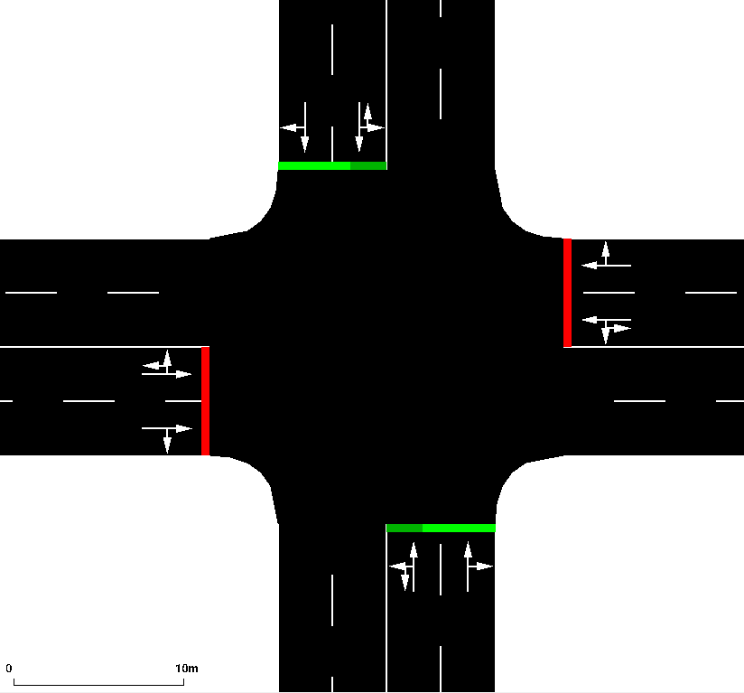

# Traffic_Control_Benchmark
Benchmark for traffic control algorithms

## 路网和需求生成
`gen_net_demand.py` 文件中的调用`generate_net_demand(data_dir,xnum=3,ynum=3)`函数可以快速生成对应格点数目的grid 路网，默认生成3X3的格点路网，默认路口之间的距离为1km，每条edge默认包含两条lane

例子：
现已生成3x3,5x5路网及其需求文件

单一路口：

3x3路网

