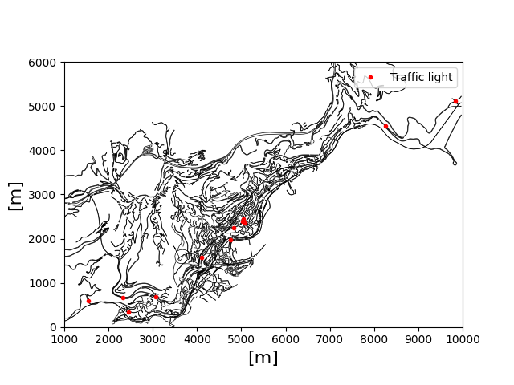
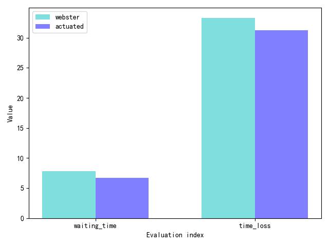

# Traffic_Control_Benchmark
Benchmark for traffic control algorithms

## Datasets

* Synthetic traffic networks

| intersection channelization                                  | 1x1grid                                                      |
| ------------------------------------------------------------ | ------------------------------------------------------------ |
|  |  |
| 3x3grid                                                      | 5x5grid                                                      |
|                                                              |                                                              |

* Real traffic networks

|              Luxembourg              |            Monaco            |
| :--------------------------------- | :------------------------- |
|  |  |
|             **TAPASCologne**             |            **Malaga**            |
|                                      |                              |
| **Hefei** | |
| | |

## Traffic Control Methods
| Controllers              | Introduction                                                 |
| ------------------------ | :----------------------------------------------------------- |
| Webster's method         | Webster’s method of traffic signal design is an analytical approach of determining the optimum signal cycle time, corresponding to minimum total delay to all the vehicles at the approach roads of the intersection. |
| Actuated traffic control | An actuated traffic signal controller determines the timing and even the sequence of traffic movement for each phase and cycle, based on what vehicles or pedestrians are detected at the intersection. |

## Controllers comparison

| Networks     | Comparasion results                                          |
| ------------ | ------------------------------------------------------------ |
| 1x1grid      |  |
| 5x5grid      |                                                              |
| Luxembourg   |                                                              |
| Monaco       |                                                              |
| TAPASCologne |                                                              |
| Malaga       |                                                              |


## Quick Start

###Build the sumofile of grid traffic networks

```bash
python3 gen_net_demand.py 
```

### Build the sumofile of real traffic scenarios

```bash
python3 utils/build_nets --netname [netname1] [netname1]
```

For example, to build Luxembourg and Monaco sumofiles for experiments: 

```bash
python3 utils/build_nets --netname Luxembourg Monaco
```

###  Implement baseline methods in SUMO

* To implement Webster's method in SUMO: 

  ```bash
  python baseline_result.py --sumo_cfg [sumocfg_dir] webster
  ```

* To implement actuated traffic controller method in SUMO: 

  ```bash
  python baseline_result.py --sumo_cfg [sumocfg_dir] actuated --minDur [minDur] --maxDur [maxDur]
  ```

### Compare different control methods

```bash
python result_plot.py --method_1 [name_of_method_1] --tripinfo_dir_1 [tripinfo_dir_1] --method_2 [name_of_method_2] --tripinfo_dir_2 [tripinfo_dir_2]
```


## References

### Datasets

* [Sumo Data/Scenarios](https://sumo.dlr.de/docs/Data/Scenarios.html#monaco_sumo_traffic_most)
* Daniel H. Stolfi and Enrique Alba. Generating Realistic Urban Traffic Flows with Evolutionary Techniques. In: *Engineering Applications of Artificial Intelligence*, vol. 75, pp. 36-47, 2018. [[Project](https://en.danielstolfi.com/fga/index.php)]

### Control Methods

* Webster

* Actuated controller

  

## License

This work is released under the MIT license.